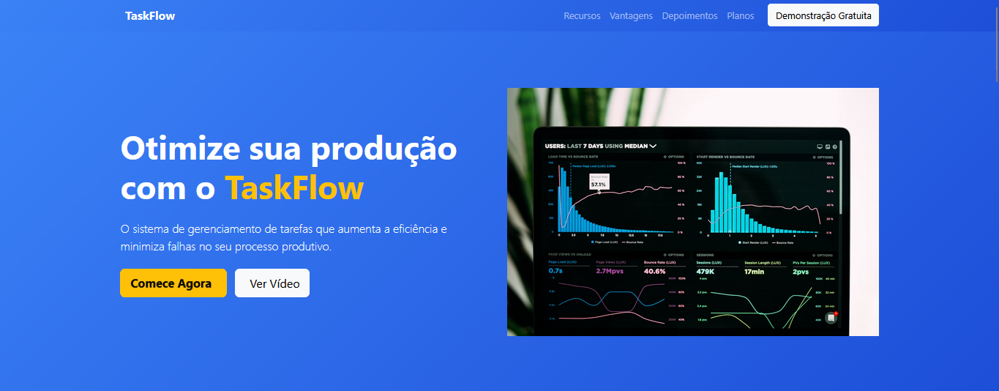
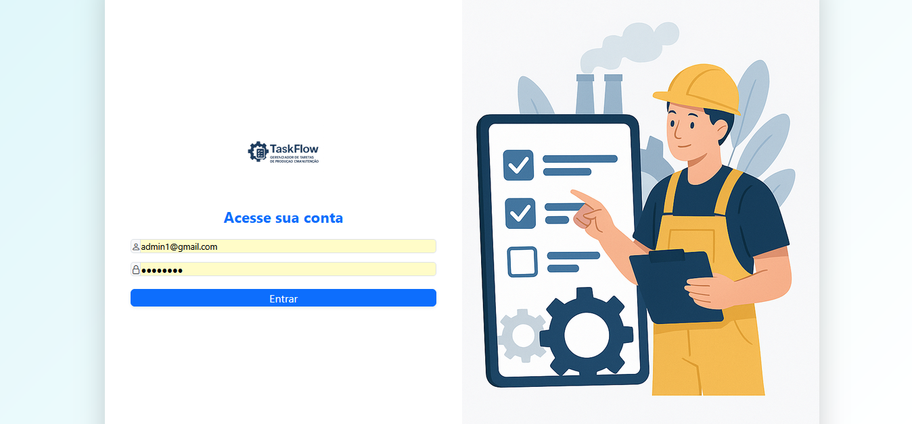

 # TestflowApp

O *TaskFlow – Gerenciador de Tarefas de Produção e Manutenção* é um sistema simples de gerenciamento de tarefas que visa otimizar e organizar a execução de tarefas diárias em uma fábrica ou ambiente industrial. Ele facilita a visualização e o acompanhamento de tarefas, tanto para operadores quanto para técnicos de manutenção, com o objetivo de *aumentar a eficiência e minimizar falhas ou atrasos* no processo de produção.

---

## 📸 Capturas de Tela do projeto

### Tela de HomePage


---
### Login


---
### Tarefas
!
---

### Dashboard

---


## 🚀 Funcionalidades do TestflowApp

#### 1. *Cadastro e Acompanhamento de Tarefas*

Cada tarefa tem:

* *Título*: Nome da tarefa.
* *Descrição*: Detalhes ou instruções sobre o que precisa ser feito.
* *Status*: Indicadores de progresso, como "Pendente", "Em Progresso" ou "Concluída".
* *Responsável*: Atribuição de tarefas para um operador ou técnico.
* *Prazo de Conclusão*: Quando a tarefa precisa ser finalizada.

#### 2. *Interface Simples e Intuitiva*

A aplicação pode ter:

* *Dashboard*: Um painel com tarefas pendentes e concluídas, além de gráficos simples de desempenho.
* *Lista de Tarefas*: Exibição de todas as tarefas programadas, com filtros por status, operador ou prazo.
* *Formulário de Tarefa*: Para criar ou editar tarefas, permitindo adicionar descrições detalhadas e definir o status e responsável.


#### 3. *Relatórios e Performance*

* *Relatório de Tarefas Concluídas*: Para que supervisores possam monitorar a produtividade de cada operador e o tempo médio de execução das tarefas.
* *Gráficos de Desempenho: Gráficos simples usando **Chart.js* ou *ngx-charts*, como total de tarefas concluídas por dia, tempo médio de execução, etc.

---

## 🛠️ Tecnologias Utilizadas

- **Angular 19 (Standalone Components)**
- **Bootstrap 5.3**
- **TypeScript**
- **Node.js (API interna)**
- **SCSS/CSS modularizado**
- **Angular Material (em partes)**
- **Chart.js (para gráficos)**
- **ngx-charts**

---

## ▶️ Como Rodar o Projeto

### 🔧 API (Mock interna)
1. Acesse a pasta do projeto
2. Inicie a API mock (caso ativada via script):
   ```bash
   npm start
   ```

### 🖥️ Frontend
1. Instale as dependências:
   ```bash
   npm install, npm install @angular, npm install bootstrap, npm install chart.js, npm install ngx-charts, 
   ```
2. Rode o servidor de desenvolvimento:
   ```bash
   ng serve
   ```
3. Acesse em: `http://localhost:4200`

---

## 🧠 Requisitos de Login

- **Usuário:** admin1@gmail.com 
- **Senha:** admin123

---

## 📁 Estrutura de Pastas (resumo)

```
📦 backend
├── db.json
├── api
│   ├── index.js

📦 projeto-angular
├── src
│   ├── app
│   │   ├── home=page/
│   │   ├── login/
│   │   ├── home/
│   │   ├── header/
│   │   ├── task-list/
│   │   ├── task-detail/
│   │   ├── task-form/
│   │   ├── sumary/
│   │   ├── services/services/
│   │   ├── app.routes.ts
│   ├── assets/api/
│   ├── main.ts
├── angular.json
├── package.json
```

---


---

## 👨‍💻 Autor

**Maicon Douglas Alves De Oliveira**  
Estudante de engenharia da computação pela UFBA - Ciência e Tecnologia  
[GitHub - @MMDProgramado](https://github.com/MDProgramado/)


